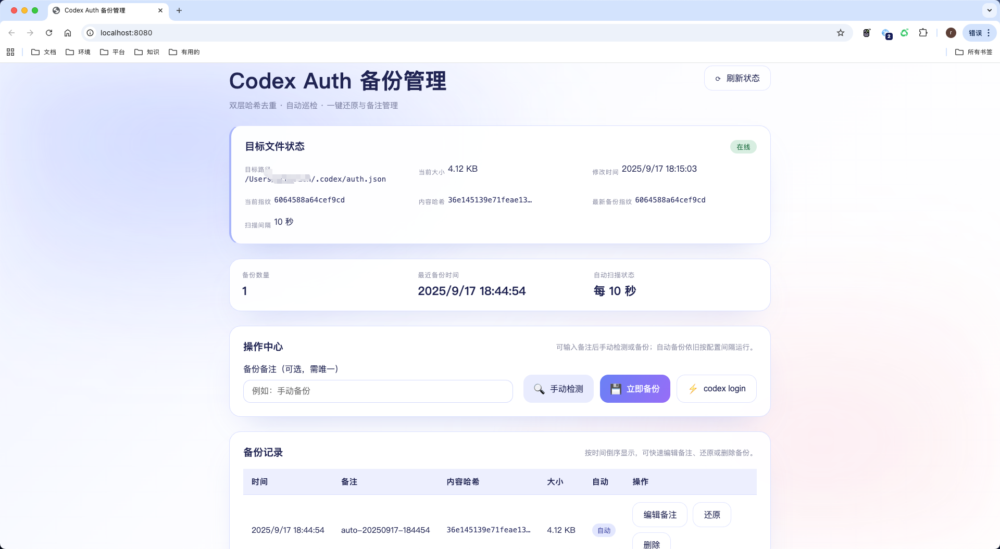

# Codex Auth 备份管理工具

基于 Go 语言构建的本地 Web 工具，专为 Codex 使用者设计，帮助在多账号场景下快速备份/切换 `~/.codex/auth.json`。应用启动后会自动打开浏览器进入管理页面，提供手动/自动备份、备注管理、还原与 `codex login` 命令一站式入口，让账号切换安全又高效。

## 核心功能
- **双重去重**：利用文件元信息快速生成指纹 + 全量 SHA-256 内容哈希，避免重复备份。
- **自动备份**：按配置间隔扫描目标文件，发现变化自动备份并生成唯一自动备注。
- **手动操作**：在页面或 API 中触发检测、备份、还原和删除动作，支持备注唯一性校验与编辑。
- **安全写入**：`index.json` 与备份文件采用文件锁 + 临时文件原子替换，避免并发损坏。
- **命令调用**：提供按钮与接口执行 `codex login`，返回标准输出/错误输出。
- **多账号切换友好**：备份历史随时可还原，配合 `codex login` 一键切换当前账号。
- **自动打开浏览器**：服务启动后自动在默认浏览器打开首页。

## 目录结构
```
.
├── cmd/server/main.go        # 服务入口、HTTP 服务器及浏览器启动逻辑
├── internal/
│   ├── api/handlers.go       # REST API 处理器
│   ├── core/
│   │   ├── backup.go         # 备份文件命名与写入
│   │   ├── exec.go           # codex login 命令执行
│   │   ├── hash.go/.goos.go  # 指纹与内容哈希
│   │   ├── service.go        # 业务核心、定时扫描、备注处理
│   │   ├── service_test.go   # 核心流程单元测试
│   │   └── store.go          # index.json 存储与锁
│   └── util/                 # 路径展开、原子写、文件锁工具
├── web/
│   ├── index.html            # 前端页面
│   ├── style.css             # 页面样式
│   └── app.js                # 前端逻辑
├── data/                     # 运行时生成（默认空）
├── README.md                 # 使用说明（当前文档）
└── TASK.md                   # 开发过程记录
```

## 环境与配置
- Go 1.21+
- 自动打开浏览器需系统提供以下命令之一：macOS `open`、Linux `xdg-open`、Windows `rundll32`。

### 配置文件（`config.json`）
应用默认在工作目录读取 `config.json`（可通过 `-config` 指定路径）。若文件不存在，将使用默认值并在日志中提示。示例：

```json
{
  "codex_dir": "~/.codex",
  "codex_file": "auth.json",
  "data_dir": "./data",
  "http_port": "8080",
  "scan_interval": 60,
  "auto_open_browser": true
}
```

| 字段 | 说明 | 默认值 |
|------|------|--------|
| `codex_dir` | 目标目录 | `~/.codex` |
| `codex_file` | 目标文件名 | `auth.json` |
| `data_dir` | 索引与备份输出目录 | `./data` |
| `http_port` | HTTP 服务端口 | `8080` |
| `scan_interval` | 自动扫描间隔（秒，`≤0` 关闭自动备份） | `60` |
| `auto_open_browser` | 启动后是否自动打开默认浏览器 | `true` |

## 快速开始
```bash
# 1. 创建配置文件
cat > config.json <<'JSON'
{
  "codex_dir": "~/.codex",
  "codex_file": "auth.json",
  "data_dir": "./data",
  "http_port": "8080",
  "scan_interval": 60,
  "auto_open_browser": true
}
JSON

# 2. 构建二进制
go build -o codex-backup-tool ./cmd/server

# 3. 启动（默认读取 ./config.json）
./codex-backup-tool

# 使用自定义配置路径
./codex-backup-tool -config /path/to/config.json
```

运行后目录示例：
```
data/
├── index.json
└── backups/
    ├── 20250917-153012_a1b2c3.json
    └── ...
```

## 界面预览



## Web 前端使用
启动成功后页面包含：
- **目标文件状态卡片**：展示存在性、大小、修改时间、指纹、内容哈希、最新备份指纹及扫描间隔。
- **概要指标卡片**：实时统计备份数量、最近备份时间与自动扫描状态。
- **操作中心**：输入备注后可手动检测/备份，并支持一键执行 `codex login`。
- **备份列表**：倒序显示所有备份，支持编辑备注、还原及删除（悬停可查看完整哈希）。
- **通知 Toast**：操作成功或失败均有直观提示。
- **自动刷新**：前端依据 `scan_interval` 设置自动轮询（`≤0` 表示仅手动刷新），页面重新聚焦也会即时刷新。

## REST API
所有响应统一为 `{ "ok": bool, "data": any, "error": string|null }`。

| 方法 | 路径 | 描述 |
|------|------|------|
| GET | `/api/status` | 获取目标文件状态 |
| POST | `/api/scan` | 手动检测并视情况备份 |
| GET | `/api/backups` | 列出备份（倒序） |
| POST | `/api/backups` | 手动备份，可附 `remark` |
| PATCH | `/api/backups/{id}/remark` | 更新备注（唯一） |
| POST | `/api/backups/{id}/restore` | 将备份覆盖写回目标文件 |
| DELETE | `/api/backups/{id}` | 删除备份文件与索引 |
| POST | `/api/codex/login` | 执行 `codex login` 命令 |

请求示例：
```bash
curl -X POST http://localhost:8080/api/backups \
  -H 'Content-Type: application/json' \
  -d '{"remark":"手动-下午"}'
```

## 自动扫描与去重策略
1. 定时任务每配置文件中的 `scan_interval` 秒检查目标文件，生成快速指纹。
2. 若指纹与 `index.json` 中记录一致，则跳过备份。
3. 指纹不同则计算 SHA-256 内容哈希：
   - 若哈希已存在，仅更新最新指纹日志。
   - 否则生成新备份文件，写入 `data/backups/`，并更新 `index.json`、备注索引。
4. 自动生成备注格式为 `auto-YYYYMMDD-HHMMSS`，如冲突自动追加 `-n`。

## 还原与删除
- 还原操作直接覆盖目标文件，不额外创建 `.bak`。
- 删除备份会移除文件与索引记录，若备注存在于索引将同步移除。

## 命令执行
- 前端按钮和 `/api/codex/login` 均调用 `codex login`。
- 执行超时时间：2 分钟。
- 返回值包含标准输出、标准错误与 `exit_code`；若失败 `ok=false` 并附带错误消息。

## 测试
```bash
go test ./...
```

测试涵盖：
- 首次备份、重复备份去重、内容变化新增备份。
- 备注唯一性校验。
- 还原后内容一致。

## 故障排查
| 问题 | 排查建议 |
|------|-----------|
| 启动失败并提示配置错误 | 检查 `config.json` 字段是否填写正确，以及相关目录是否存在且可写 |
| 自动打开浏览器失败 | 查看日志 `自动打开浏览器失败`，确认系统是否存在对应命令，如 Linux 需安装 `xdg-open` |
| 备注冲突 | 在前端提示或 API 409 响应后更换备注 |
| 无法自动备份 | 确认 `config.json` 中 `scan_interval` 是否大于 0，目标文件存在且 `index.json` 可写 |

## 联系我


## 许可证
MIT
